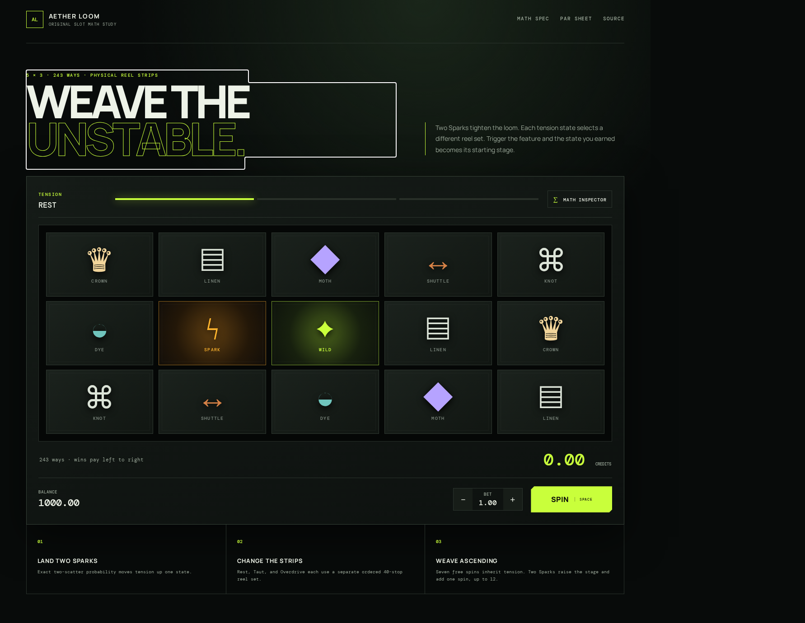
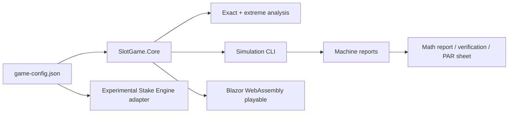

# Aether Loom

[**PLAY LIVE**](https://walidelkersh.github.io/aether-loom/) · [**VIEW PAR SHEET**](docs/PAR-sheet.pdf) · [**READ THE MATH**](docs/math-report.md) · [**INSPECT REEL STRIPS**](docs/reel-strips.md)

Aether Loom is an original 5×3, 243-ways slot mathematics portfolio project. Two Spark symbols tighten a persistent loom state; the resulting Rest, Taut, or Overdrive state selects the next ordered reel set and becomes the starting stage of a seven-spin bonus. In the bonus, two Sparks advance the stage, add a spin, and move play toward richer Wild strips and larger multipliers, with a hard limit of 12 feature spins.

This is a fictional-credit demonstration. It has no deposits, purchases, payments, or real-money wagering.

## Verified model at a glance

| Quantity | Result | Classification |
|---|---:|---|
| Total RTP | **96.566915%** | Exact |
| Base ways RTP | 80.431642% | Exact |
| Feature RTP | 16.135273% | Exact |
| Base hit probability | 64.820986% | Exact |
| Feature frequency | 0.420624% / 1 in 237.74 | Exact |
| Stationary state mix | 93.2116% / 6.2962% / 0.4922% | Exact |
| Observed RTP | 96.638977% ± 0.240199% | 10,000,000-spin 95% CI |
| Overall hit frequency | 65.109340% | Simulation |
| Variance | 15.018659 bet² | Simulation |
| Standard deviation / volatility index | 3.875392× bet | Simulation |
| Maximum observed award | 731.79× | Simulation |
| Maximum reachable game cycle | 11,227.60× | Exact |

The exact total is inside the seeded simulation's 96.398778%–96.879176% confidence interval. See the full [exact-versus-simulation report](docs/verification.md).

## What is original

Tension is a paid-spin Markov state, not a decorative meter. The current state chooses one of three physical base reel sets. Zero, one, two, or three-plus Sparks produce different transitions, and an Overdrive spin always vents to Rest. The feature inherits this state, then uses a finite Markov reward process with stage-specific reel sets and 1×, 1.75×, and 3.5× multipliers.

That mechanic creates a design problem with visible consequences: scatter placement controls state occupancy and feature frequency; Wild placement controls state EV; stage multipliers allocate the feature budget; and the 12-spin bound controls exposure. The [sensitivity analysis](docs/sensitivity-analysis.md) changes these parameters one at a time and recomputes the results.

## Reel and win model

- Six named reel sets, each containing five circular 40-stop strips.
- A uniformly selected stop supplies the top symbol; the next two stops supply the middle and bottom.
- Wild and Spark symbols are spaced by at least three circular positions, limiting each to one visible occurrence per reel.
- Reel 1 has no Wild.
- A symbol pays on three or more consecutive reels from the left. Ways are the product of matching symbol/Wild counts on those reels.
- Only the longest occurrence of each symbol pays; different symbol wins add.
- Spark has no direct cash pay.

The canonical, embedded configuration is [config/game-config.json](config/game-config.json). Human-readable counts and ordered strips are in [docs/reel-strips.md](docs/reel-strips.md).

## Mathematical analysis

`ExactAnalyzer` enumerates every stop when it builds each reel's three-symbol window distribution. It then computes:

- per-symbol ways EV across five independent reel-window count distributions;
- scatter-count distributions and state transition probabilities;
- the base-state stationary distribution;
- exact feature-entry probability;
- exact feature EV and duration with finite reward recursion;
- exact base hit probability from the first three reel windows.

`ExtremeAnalyzer` performs reachable-profile dynamic programming to find maximum base, feature, and full-cycle awards. Monte Carlo independently executes the production state loop and uses Welford's recurrence for numerically stable variance.

## Architecture



- `src/SlotGame.Core` — canonical strips, PCG32 RNG, ways evaluator, persistent state, bonus, exact analysis.
- `src/SlotGame.Simulation` — CLI, Welford statistics, seeded Monte Carlo, sensitivity runner, fixture export.
- `src/SlotGame.Playable` — browser client that references `SlotGame.Core` directly.
- `tests/SlotGame.Tests` — 27 unit, invariant, deterministic, and statistical tests.
- `tests/e2e` — recruiter-flow browser test.
- `integrations/stake-engine` — experimental public-SDK representation and nine-fixture parity check.

The [existing-work assessment](docs/architecture-assessment.md) explains what was inspected and why the previous weighted-cell simulator was not reused as the canonical model.

## Run it

Requires .NET 8. The browser test also requires Node.js and Playwright Chromium.

```bash
dotnet build AetherLoom.sln --configuration Release
dotnet test AetherLoom.sln --configuration Release

dotnet run --project src/SlotGame.Simulation -- --spins 1000000 --seed 20260908
dotnet run --project src/SlotGame.Simulation -- --theory-only
dotnet run --project src/SlotGame.Simulation -- --extremes
dotnet run --project src/SlotGame.Simulation -- --sensitivity --spins 500000

dotnet run --project src/SlotGame.Playable
```

To reproduce documentation inputs:

```bash
dotnet run --project src/SlotGame.Simulation -- --spins 10000000 --seed 20260908 --output reports/verified-metrics.json
dotnet run --project src/SlotGame.Simulation -- --extremes --output reports/extremes.json
dotnet run --project src/SlotGame.Simulation -- --sensitivity --spins 500000 --seed 77001 --output reports/sensitivity.json
python scripts/generate_docs.py
```

## What I Built

This repository's game concept, state mechanic, paytable, six reel sets, C# core, exact analyzer, extreme-value analyzer, simulation executable, Blazor playable, Math Inspector, tests, reports, PAR sheet, and case study were authored specifically for Aether Loom. The earlier slot simulation engine was inspected for useful boundaries and validation ideas; its Python/JavaScript implementation and independent weighted-cell outcome model were not copied into this project.

## Further reading

- [Game design and math specification](docs/game-design.md)
- [Mathematical model and RTP budget](docs/math-report.md)
- [Exact versus simulation](docs/verification.md)
- [Sensitivity analysis](docs/sensitivity-analysis.md)
- [Portfolio case study](docs/case-study.md)
- [Experimental Stake Engine representation](integrations/stake-engine/README.md)

Released under the [MIT License](LICENSE). The project makes no regulatory or production-compatibility claim.
