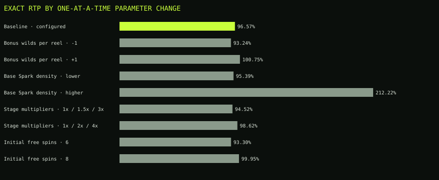

# Sensitivity analysis

Each row changes one parameter family from version 1.0.0. Exact RTP, feature frequency, and maximum exposure are recomputed from the altered model. Hit frequency and standard deviation use 500,000 seeded paid spins per scenario. Because maximum observed win is unstable at this sample size, the comparison uses the exact reachable maximum instead.

| Parameter | Level | Exact RTP | Exact feature rate | Sim hit rate | Sim σ | Exact max |
|---|---|---:|---:|---:|---:|---:|
| Baseline | configured | 96.5669% | 0.4206% | 65.0204% | 3.8526× | 11,227.60× |
| Bonus wilds per reel | -1 | 93.2367% | 0.4206% | 65.1110% | 3.1828× | 11,227.60× |
| Bonus wilds per reel | +1 | 100.7503% | 0.4206% | 65.1908% | 4.6621× | 11,563.60× |
| Base Spark density | lower | 95.3858% | 0.0000% | 70.0614% | 1.5150× | 11,227.15× |
| Base Spark density | higher | 212.2207% | 3.1288% | 61.7292% | 11.0465× | 11,247.30× |
| Stage multipliers | 1x / 1.5x / 3x | 94.5155% | 0.4206% | 65.0882% | 3.3200× | 9,626.60× |
| Stage multipliers | 1x / 2x / 4x | 98.6183% | 0.4206% | 65.1176% | 4.3843× | 12,828.60× |
| Initial free spins | 6 | 93.3031% | 0.4206% | 65.0942% | 3.3410× | 10,058.60× |
| Initial free spins | 8 | 99.9501% | 0.4206% | 65.1670% | 4.5126× | 12,396.60× |

The results show four distinct controls:

- Bonus Wild density primarily moves feature RTP and volatility. Removing one Wild from reels 2–5 in every bonus set lowers total RTP by 3.3302 percentage points; adding one raises it by 4.1834 points.
- Base Spark density controls both the stationary tension mix and feature entry. The deliberately broad high case raises the feature rate from 0.4206% to 3.1288% and makes the model unsuitable at 212.2207% RTP. This is a boundary experiment, not a proposed configuration.
- Stage multipliers change the feature budget without changing feature-entry probability. The low and high schedules move total RTP to 94.5155% and 98.6183%.
- Initial free spins move total RTP and variance together while leaving entry frequency unchanged. Six spins return 93.3031%; eight return 99.9501%.

